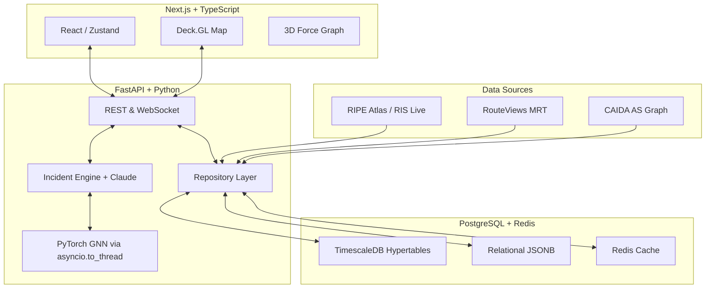

# NetPulse 🌐

> **Predict internet weather before it storms.**

[](#)
[](https://opensource.org/licenses/MIT)

NetPulse is a predictive internet path intelligence platform. Unlike traditional reactive monitoring tools (like Downdetector or ThousandEyes) that alert you *after* a service goes down, NetPulse combines real-time BGP data, active network measurements, and Spatio-Temporal Graph Neural Networks (GNNs) to **forecast internet instability before it impacts users**.

---

## 💡 Why This is Hard

Internet routing is a decentralized, trustless web of over 70,000 Autonomous Systems (AS). When a major transit provider misconfigures a router or a fiber cut occurs, the shockwaves propagate through BGP updates globally.
1. **Volume & Velocity**: BGP churn generates thousands of updates per second. Processing and correlating this with active latency measurements in real-time requires a highly optimized ingestion pipeline and a specialized time-series database.
2. **Topology Context**: A 200ms latency spike is noise. A 200ms latency spike correlated with a BGP withdrawal from an upstream transit provider is a critical incident. Understanding this requires mapping alerts against a live graph of the internet.
3. **Predictive Modeling**: Deep learning on graphs (GNNs) is notoriously difficult to run concurrently without blocking event loops.

## ✨ Features

- **Temporal GNN Engine**: Predicts cascading failures across the BGP AS Topology.
- **Incident Engine**: Correlates GNN scores with latency Z-score spikes to identify genuine incidents.
- **AI Root Cause Analysis**: Leverages Anthropic's Claude to generate bounded, 2-3 sentence explanations for confirmed incidents.
- **Interactive Topology**: Explore the internet graph via a WebGL-powered 3D AS relationship visualization.
- **Live World Map**: Real-time geographical plotting of RIPE Atlas probes and anomaly heatmaps.

---

## 🏗 Architecture

NetPulse utilizes a modern, strictly-typed monorepo stack:



---

## 🚀 Quick Start

### Prerequisites
- Python 3.11+
- Node.js 18+
- PostgreSQL 16+ with [TimescaleDB](https://docs.timescale.com/install/latest/) extension
- Redis 7+

### Backend Setup

```bash
cd backend
python -m venv .venv
source .venv/bin/activate  # Windows: .venv\Scripts\activate
pip install -e .

cp .env.example .env
```

**Required Environment Variables (`.env`)**:
| Variable | Description |
|---|---|
| `NETPULSE_DATABASE_URL` | PostgreSQL connection string (asyncpg) |
| `NETPULSE_JWT_SECRET_KEY` | 32-byte hex secret for JWT signing |
| `NETPULSE_CLAUDE_API_KEY` | Anthropic API Key (Required for explanations) |
| `NETPULSE_CORS_ORIGINS` | JSON list of allowed origins (e.g. `["http://localhost:3000"]`) |

```bash
# Run database migrations
alembic upgrade head

# Start the development server
uvicorn app.main:app --reload --port 8000
```

### Frontend Setup

```bash
cd frontend
npm install
npm run dev
```

Visit `http://localhost:3000` to view the dashboard.

---

## 🎙️ Interview Talking Points

Building NetPulse required navigating complex architectural tradeoffs. Here are the 5 hardest engineering decisions and how they were solved:

1. **TimescaleDB over standard PostgreSQL for Time-Series**
   * **Challenge**: Ingesting raw RIPE Atlas and BGP metrics yields massive time-series volumes. Standard Postgres B-Tree indexes severely degrade on massive inserts.
   * **Solution**: Adopted TimescaleDB hypertables (`docs/adr/0001-database-choice.md`). Partitioning by time natively allows us to achieve high-throughput ingestion without sacrificing relational integrity for users/API keys.
2. **Custom PyTorch GNN vs. Event Loop Blocking**
   * **Challenge**: FastAPI runs on an asynchronous event loop. Executing PyTorch tensor multiplications for the GNN predictions is a synchronous, CPU-bound operation that would starve the server.
   * **Solution**: Refactored the ML engine inference to be explicitly offloaded via `asyncio.to_thread()`, ensuring concurrent HTTP requests and WebSocket streams remain perfectly responsive while the ML crunches in the background.
3. **Repository Pattern Enforcement**
   * **Challenge**: FastAPI route handlers often become "God objects," deeply coupling HTTP transport logic with raw SQLAlchemy queries. 
   * **Solution**: Implemented a strict Clean Architecture via the Repository Pattern (`app/db/repositories/`). All SQL is isolated, domain exceptions are centralized, and routers only ever interact with strongly-typed Python primitives.
4. **LLM Usage Boundaries**
   * **Challenge**: Slapping a chatbox onto network data is slow, expensive, and prone to hallucination.
   * **Solution**: Rejected open-ended LLM chat (`docs/adr/0004-llm-usage-boundary.md`). We implemented a deterministic Incident Engine that makes the actual decision. Claude is only invoked *after* an incident is confirmed, fed a strict Pydantic JSON payload, and instructed to output a constrained 2-3 sentence root-cause hypothesis.
5. **Frontend Bundle Optimization (WebGL)**
   * **Challenge**: The frontend relies on massive WebGL libraries (`react-map-gl`, `force-graph`) which were bloating the initial JavaScript chunk and destroying Time-To-Interactive (TTI).
   * **Solution**: Implemented Next.js Code Splitting (`next/dynamic` with `ssr: false`). The heavy visual components are lazily loaded only when the client reaches the browser, keeping the core dashboard snappy.

---

## 📚 Documentation Directory

- **[System Design](docs/SYSTEM_DESIGN.md)** - Deep dive into data flow and component scaling.
- **[Architecture (ADRs)](docs/ARCHITECTURE.md)** - Record of architectural decisions.
- **[API Reference](docs/API.md)** - Endpoints, schemas, and authentication.
- **[Datasets](docs/DATASETS.md)** - Attribution and processing for RIPE, CAIDA, and RouteViews.
- **[Machine Learning](docs/ML_EVALUATION.md)** - Metrics and findings of the ML models.
- **[Testing](docs/TESTING.md)** - E2E and Pytest strategy.
- **[Security](docs/SECURITY.md)** - Threat model and mitigations.
- **[Performance](docs/PERFORMANCE.md)** - Benchmarks and optimizations.
- **[Changelog](docs/CHANGELOG.md)** - Implementation history.
- **[Known Limitations](docs/KNOWN_LIMITATIONS.md)** - Honest technical debt and bounds.
- **[Roadmap](docs/ROADMAP.md)** - Future expansions.

## Attribution

This project uses the following datasets:
- **CAIDA AS Relationships Dataset** — "The CAIDA AS Relationships Dataset, https://www.caida.org/catalog/datasets/as-relationships/"
- **RIPE Atlas** — RIPE NCC, https://atlas.ripe.net/
- **RIPE RIS** — RIPE NCC, https://ris.ripe.net/
- **RouteViews** — University of Oregon, http://www.routeviews.org/
- **Cloudflare Radar** — Cloudflare, Inc. (CC BY-NC 4.0), https://radar.cloudflare.com/

