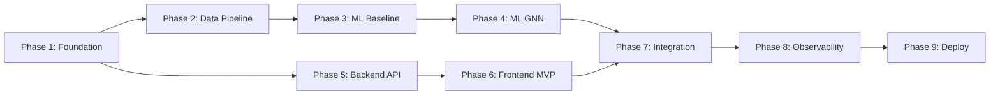

# NetPulse — Implementation Plan

**Last Updated:** 2026-07-04
**Current Phase:** 0 — Scope Lock (this document)

---

## Phase Overview

| Phase | Name | Goal | Status |
|---|---|---|---|
| 0 | Scope Lock | Verify feasibility, produce planning docs | ✅ Active |
| 1 | Foundation | Project scaffold, DB schema, ingestion skeleton | ⬜ |
| 2 | Data Pipeline | Live ingestion from all 5 sources, storage working | ⬜ |
| 3 | ML — Baseline | Statistical anomaly detection, basic time-series forecasting | ⬜ |
| 4 | ML — GNN | Temporal GNN over AS graph, instability prediction | ⬜ |
| 5 | Backend API | REST + WebSocket endpoints, auth, caching | ⬜ |
| 6 | Frontend MVP | World map, probe overlay, incident feed | ⬜ |
| 7 | Integration | End-to-end pipeline, explanation layer, polish | ⬜ |
| 8 | Observability | Logging, metrics, health checks | ⬜ |
| 9 | Deploy | Vercel + Railway/Fly.io, CI/CD | ⬜ |

---

## Phase 1: Foundation

### 1.1 Project Structure

```
netpulse/
├── backend/
│   ├── app/
│   │   ├── __init__.py
│   │   ├── main.py                  # FastAPI app entry
│   │   ├── config.py                # Settings (pydantic-settings)
│   │   ├── dependencies.py          # DI container
│   │   ├── ingestion/               # Feature folder: data ingestion
│   │   │   ├── ripe_atlas.py
│   │   │   ├── ris_live.py
│   │   │   ├── routeviews.py
│   │   │   ├── caida.py
│   │   │   └── cloudflare_radar.py
│   │   ├── storage/                 # Repository pattern
│   │   │   ├── models.py            # SQLAlchemy / TimescaleDB models
│   │   │   ├── repositories.py
│   │   │   └── migrations/          # Alembic
│   │   ├── ml/                      # ML engine
│   │   │   ├── anomaly.py
│   │   │   ├── timeseries.py
│   │   │   ├── gnn.py
│   │   │   └── explainer.py         # Claude API bounded calls
│   │   ├── api/                     # REST + WebSocket routes
│   │   │   ├── routes/
│   │   │   ├── schemas.py           # Pydantic response/request models
│   │   │   └── websocket.py
│   │   └── observability/           # Logging, metrics, health
│   │       ├── logging.py
│   │       ├── metrics.py
│   │       └── health.py
│   ├── tests/
│   ├── alembic.ini
│   ├── pyproject.toml
│   └── requirements.txt
├── frontend/
│   ├── src/
│   │   ├── app/                     # Next.js App Router
│   │   ├── components/
│   │   │   ├── map/                 # deck.gl / Mapbox map components
│   │   │   ├── graph/               # AS topology graph view
│   │   │   ├── timeline/            # Historical incident timeline
│   │   │   └── ui/                  # Shared UI components
│   │   ├── hooks/                   # Custom React hooks (WebSocket, data fetching)
│   │   ├── lib/                     # Utilities, API client, types
│   │   └── styles/                  # TailwindCSS config + custom styles
│   ├── public/
│   ├── next.config.js
│   ├── tailwind.config.ts
│   ├── tsconfig.json
│   └── package.json
├── memory.md
├── plan.md
├── FEASIBILITY.md
└── README.md
```

### 1.2 Database Schema (Initial)

```sql
-- TimescaleDB hypertable: probe latency measurements
CREATE TABLE probe_measurements (
    time        TIMESTAMPTZ NOT NULL,
    probe_id    INTEGER NOT NULL,
    target_ip   INET,
    measurement_type TEXT,        -- 'ping', 'traceroute', 'dns'
    rtt_ms      DOUBLE PRECISION,
    packet_loss DOUBLE PRECISION,  -- 0.0–1.0
    asn_src     INTEGER,
    asn_dst     INTEGER,
    country_src TEXT,
    country_dst TEXT,
    raw_json    JSONB
);
SELECT create_hypertable('probe_measurements', 'time');

-- TimescaleDB hypertable: BGP events
CREATE TABLE bgp_events (
    time        TIMESTAMPTZ NOT NULL,
    collector   TEXT NOT NULL,       -- RIS collector or RouteViews
    event_type  TEXT NOT NULL,       -- 'announcement', 'withdrawal', 'path_change'
    prefix      CIDR,
    peer_asn    INTEGER,
    origin_asn  INTEGER,
    as_path     INTEGER[],
    communities INTEGER[][],
    raw_json    JSONB
);
SELECT create_hypertable('bgp_events', 'time');

-- AS topology graph (refreshed from CAIDA periodically)
CREATE TABLE as_relationships (
    asn_a       INTEGER NOT NULL,
    asn_b       INTEGER NOT NULL,
    rel_type    TEXT NOT NULL,        -- 'customer', 'peer', 'provider'
    source      TEXT DEFAULT 'caida', -- 'caida-serial1', 'caida-serial2'
    updated_at  TIMESTAMPTZ DEFAULT NOW(),
    PRIMARY KEY (asn_a, asn_b)
);

-- AS metadata
CREATE TABLE as_metadata (
    asn         INTEGER PRIMARY KEY,
    name        TEXT,
    org         TEXT,
    country     TEXT,
    cone_size   INTEGER,             -- customer cone size
    updated_at  TIMESTAMPTZ DEFAULT NOW()
);

-- ML predictions / incidents
CREATE TABLE incidents (
    id              UUID PRIMARY KEY DEFAULT gen_random_uuid(),
    detected_at     TIMESTAMPTZ NOT NULL,
    severity        TEXT NOT NULL,     -- 'low', 'medium', 'high', 'critical'
    incident_type   TEXT NOT NULL,     -- 'latency_spike', 'bgp_hijack', 'route_leak', 'outage'
    affected_asns   INTEGER[],
    affected_prefixes CIDR[],
    prediction_score DOUBLE PRECISION, -- 0.0–1.0
    explanation     TEXT,              -- Claude-generated, cached
    resolved_at     TIMESTAMPTZ,
    metadata        JSONB
);

-- Probe registry (cached from RIPE Atlas)
CREATE TABLE probes (
    probe_id    INTEGER PRIMARY KEY,
    asn         INTEGER,
    country     TEXT,
    latitude    DOUBLE PRECISION,
    longitude   DOUBLE PRECISION,
    status      TEXT,                  -- 'connected', 'disconnected'
    updated_at  TIMESTAMPTZ DEFAULT NOW()
);
```

### 1.3 Deliverables
- [ ] Python project with `pyproject.toml`, dependency management (uv or pip-tools)
- [ ] Next.js project scaffolded with TypeScript + TailwindCSS
- [ ] PostgreSQL + TimescaleDB schema applied via Alembic migration
- [ ] Redis connection established
- [ ] Config management via environment variables (pydantic-settings)
- [ ] Basic health check endpoint (`GET /health`)

---

## Phase 2: Data Pipeline

### 2.1 Ingestion Jobs

| Source | Method | Frequency | Priority |
|---|---|---|---|
| RIPE Atlas | REST API (public measurements) | Every 5 min | P0 — MVP |
| RIPE RIS Live | WebSocket stream | Continuous | P0 — MVP |
| RouteViews | MRT archive download + parse | Every 15 min | P1 — post-MVP |
| CAIDA AS Rel | HTTP download + parse | Daily | P0 — MVP |
| Cloudflare Radar | REST API | Every 15 min | P2 — corroboration |

### 2.2 Deliverables
- [ ] RIPE Atlas ingestion: fetch built-in ping/traceroute measurements, store in `probe_measurements`
- [ ] RIS Live consumer: WebSocket client, parse BGP updates, store in `bgp_events`
- [ ] CAIDA loader: download latest serial-2, parse, upsert `as_relationships`
- [ ] RouteViews parser: download latest MRT dump, parse with BGPKIT, store in `bgp_events`
- [ ] Cloudflare Radar poller: fetch outage/traffic signals, store as corroboration metadata
- [ ] Backfill script: seed database with 30 days of historical data for ML training

---

## Phase 3: ML — Baseline

### 3.1 Components

1. **Anomaly Scorer (Statistical)**
   - Per-probe Z-score / Median Absolute Deviation on RTT and packet loss
   - Per-AS BGP churn rate (announcements + withdrawals per minute) vs. rolling baseline
   - Output: anomaly score 0.0–1.0 per probe/AS per time window

2. **Time-Series Forecaster (Lightweight)**
   - Input: per-probe RTT time series (5-min aggregates)
   - Model: LSTM or lightweight Transformer (1–2 layers)
   - Output: predicted RTT for next 15/30/60 min
   - Training: 30 days of historical probe data

### 3.2 Deliverables
- [ ] Statistical anomaly detection running on live data
- [ ] Time-series model trained on historical data
- [ ] Anomaly + forecast results written to a `predictions` table
- [ ] Basic incident detection logic: anomaly score > threshold → create incident

---

## Phase 4: ML — GNN

### 4.1 Temporal GNN Design

- **Graph:** AS topology from CAIDA, edges = AS relationships
- **Node Features (per snapshot):**
  - Mean/p95 latency from probes in that AS (aggregated from `probe_measurements`)
  - Packet loss rate
  - BGP churn rate (events/min from `bgp_events`)
  - Historical anomaly score (from Phase 3)
  - Structural features: degree, customer cone size
- **Snapshots:** Discrete time windows (e.g., 1-hour intervals)
- **Architecture:** Recurrent Graph Convolutional Network (RGCN) via PyTorch Geometric Temporal
- **Target:** Per-AS instability probability in the next 1–4 hours
- **Training:** 30–90 days of aligned graph + measurement snapshots

### 4.2 Scope-Down Path (MVP Graph)
- Full internet AS graph: ~75,000 ASes, ~300,000 edges — may be too large for single-GPU training
- **MVP subgraph:** Top 2,000–5,000 transit ASes (by customer cone size) + their direct neighbors
- This covers the backbone where most incidents propagate

### 4.3 Deliverables
- [ ] Graph snapshot builder: align CAIDA topology + measurement features per time window
- [ ] Temporal GNN model (PyTorch Geometric Temporal)
- [ ] Training pipeline with validation split
- [ ] Inference service: produce per-AS instability scores on schedule
- [ ] Integration with incident detection

---

## Phase 5: Backend API

### 5.1 Endpoints

| Method | Path | Description |
|---|---|---|
| GET | `/health` | Health check |
| GET | `/api/v1/map/probes` | Probe locations + status for map |
| GET | `/api/v1/map/incidents` | Active incidents with geo coordinates |
| GET | `/api/v1/as/{asn}` | AS detail: metadata, current scores, history |
| GET | `/api/v1/as/{asn}/predictions` | Instability predictions for an AS |
| GET | `/api/v1/incidents` | Paginated incident list with filters |
| GET | `/api/v1/incidents/{id}` | Incident detail + explanation |
| GET | `/api/v1/topology` | AS topology graph (filtered subgraph) |
| GET | `/api/v1/timeseries/{probe_id}` | Latency time series for a probe |
| WS  | `/ws/live` | Real-time incident + measurement updates |

### 5.2 Deliverables
- [ ] FastAPI app with all endpoints
- [ ] JWT authentication (API keys for programmatic access)
- [ ] Rate limiting (Redis-backed sliding window)
- [ ] Redis caching for hot queries (map tiles, active incidents)
- [ ] WebSocket manager for live updates
- [ ] OpenAPI documentation auto-generated

---

## Phase 6: Frontend MVP

### 6.1 Pages / Views

1. **Dashboard / Map View** — Interactive world map with live probes, incident overlays, heatmap of predicted instability
2. **AS Detail View** — Deep dive into a specific AS: latency trends, BGP churn, prediction scores, related incidents
3. **Topology View** — Interactive AS graph (force-directed or hierarchical), colored by instability score
4. **Incident Timeline** — Historical incident list, filterable by severity/type/region, with natural-language explanations
5. **Settings** — API key management, notification preferences

### 6.2 Deliverables
- [ ] Next.js project with App Router
- [ ] Interactive map (deck.gl or Mapbox)
- [ ] Real-time updates via WebSocket hook
- [ ] AS topology graph visualization (e.g., react-force-graph or vis.js)
- [ ] Incident timeline component
- [ ] Dark mode (default)
- [ ] Responsive layout

---

## Phase 7: Integration

### 7.1 Deliverables
- [ ] End-to-end pipeline: ingestion → storage → ML → API → frontend
- [ ] Explanation layer: Claude API call on confirmed incidents, results cached in `incidents.explanation`
- [ ] Incident severity auto-escalation based on GNN + anomaly scores
- [ ] Cross-source corroboration (Cloudflare Radar confirms RIPE Atlas anomaly)
- [ ] Integration tests

---

## Phase 8: Observability

### 8.1 Deliverables
- [ ] Structured JSON logging (structlog)
- [ ] Prometheus-compatible metrics endpoint (`/metrics`)
  - Ingestion lag per source
  - ML inference latency
  - API request latency p50/p95/p99
  - Active WebSocket connections
  - Incident count by severity
- [ ] Health check endpoint with dependency status (DB, Redis, data freshness)

---

## Phase 9: Deploy

### 9.1 Deliverables
- [ ] Frontend deployed to Vercel
- [ ] Backend deployed to Railway or Fly.io (single instance)
- [ ] PostgreSQL + TimescaleDB hosted (e.g., Timescale Cloud, or Railway Postgres)
- [ ] Redis hosted (e.g., Upstash or Railway Redis)
- [ ] Environment variable management
- [ ] CI pipeline: lint + type-check + test on PR
- [ ] Basic runbook / README with setup instructions

---

## Dependencies & Critical Path



**Critical path:** P1 → P2 → P3 → P4 → P7 → P9

Frontend (P5 → P6) can proceed in parallel once the API contract is defined.

---

## Constraints Reiterated

1. **No Docker / Kubernetes** — single process deployment
2. **No microservice sprawl** — one backend service
3. **No large always-on LLM** — Claude calls bounded, cached, incident-only
4. **Single developer** — minimize operational burden
5. **Cloudflare Radar data is CC BY-NC 4.0** — non-commercial only
6. **CAIDA requires citation + publication notification**
7. **RIPE Atlas custom measurements require credits** — MVP uses public measurements only
